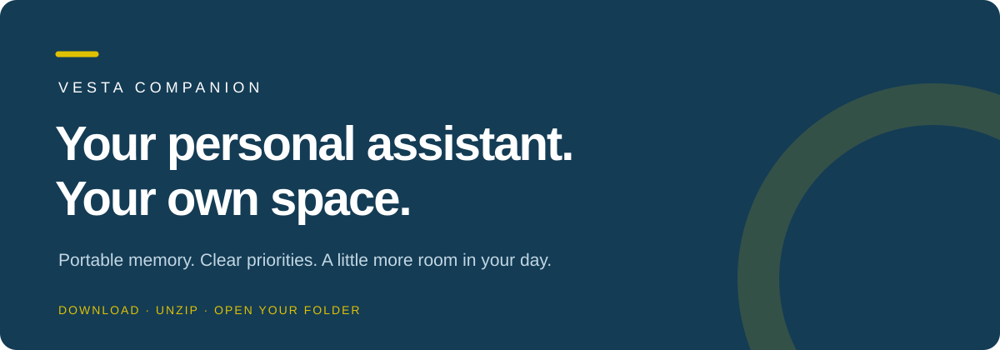
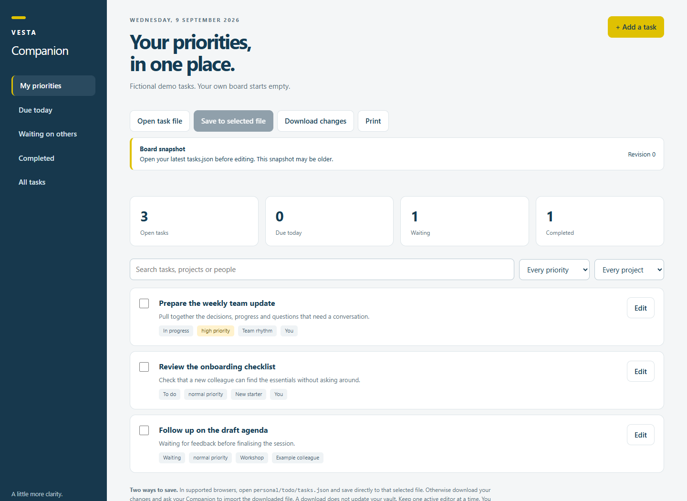

<b>A portable personal AI assistant you can make your own.</b> Download. Unzip. Open your folder. Start a conversation.

<a href="https://github.com/jjackson-vsg/vesta-companion/releases/download/v0.1.0-beta.1/vesta-companion.zip"><b>↓ DOWNLOAD VESTA COMPANION</b></a> &nbsp; · &nbsp; <a href="docs/Quick-start.pdf">Read the PDF guide</a> &nbsp; · &nbsp; <a href="https://github.com/jjackson-vsg/vesta-companion/releases">Release notes</a>

> **Beta preview.** Designed for local desktop agents. Technical tests and signed-in app testing are different: check [compatibility](docs/COMPATIBILITY.md) and [test evidence](docs/TESTING.md). Use your organisation's approved app and account. Downloads become available when the release is published.

## A useful start in three steps

| 1 · Download & unzip | 2 · Open your folder | 3 · Say hello |
|---|---|---|
| Download the release ZIP above and choose **Extract all**. Keep the files together in a private folder. | Select the folder as a **local project** in your approved agent, or connect it as a local folder. | Send the message below. Your Companion will guide you through setup. |

> Read START-HERE.md and system/COMPANION.md. Help me set up my Vesta Companion.

Give your assistant a name, tell it what matters to you, and try one useful task. Your preferences and work go into your own local **personal/** folder. You do not need a terminal, an API key or a GitHub account to use the kit. The chosen AI app may have its own subscription and installation prerequisites.

**Open START-HERE.html after unzipping** for the illustrated guide. GitHub shows HTML source; open the local file in your browser to use it. A [PDF copy](docs/Quick-start.pdf) is included too.

## Make room for the work that matters

| Ask naturally | Your Companion helps you… |
|---|---|
| “Create my daily briefing.” | Bring together Outlook email, Outlook calendar, selected Teams activity and local priorities, with sources and clear coverage gaps. |
| “Add this to my to-do list.” | Keep a clean HTML board with priorities, projects, due dates and completion tracking. |
| “Remember this for next time.” | Save useful context, decisions and knowledge as ordinary local notes. |
| “Tell me about this contact.” | Retrieve supported professional context and linked commitments. |
| “Help me plan this project.” | Define an outcome, milestones, evidence and next actions. |
| “Prepare me for this meeting.” | Gather relevant context, questions and decisions needed. |
| “Review my week.” | Find progress, blockers and open commitments. |
| “Create a skill for my monthly update.” | Draft and test a personal workflow, with explicit access boundaries. |

### Your priorities, in one place

Edit tasks in chat or on the board. The canonical task file stays on disk. In supported browsers, open your task file and save directly. Otherwise download changes and ask your Companion to import the file. **A browser tab or downloaded export is not a saved update to your vault.** Stale edits are rejected rather than silently replacing newer work.

The ZIP includes an interactive demo at **examples/board.html**, using fictional tasks. Your own board starts empty.

## Use your preferred app

| Beta target | How to start |
|---|---|
| Codex desktop | Open the folder as the primary local project and send the starter message. |
| ChatGPT Work Local | Attach the folder where local access is available; verify a save and read-back. |
| Claude Code Desktop | Choose Local and the project folder. Windows may require Git for Windows. |
| Claude Cowork | Connect the local folder and send the starter message. |
| Another capable agent | Ask it to read the shared instructions and skill index; verify local persistence before setup. |

App availability varies by version, OS, plan and company policy. Plain cloud chats need manual import/export. The folder makes context portable; app-specific permissions, connectors and schedules must be checked when switching. [Compatibility details →](docs/COMPATIBILITY.md)

## Connect Microsoft 365 when you are ready

Use your agent app's approved **Apps / Connectors / Integrations** settings for Outlook email, Outlook calendar and Teams. Select the relevant account and a useful Teams scope. Ask your administrator when approval is required. Never paste credentials into chat.

The briefing workflow is **read-only in Microsoft 365**. It does not send email, post messages, mark mail read or change calendar events. If a source is unavailable, you get a clearly labelled partial or local-only brief. The kit does not contain its own Microsoft connector, create an app registration or bypass tenant policy. Scheduling is optional, with one owner app per job.

## Memory you can keep

Your profile, notes, tasks, projects and custom skills live under **personal/**. An optional Obsidian vault gives you a friendly way to browse the notes. No Obsidian community plugins are needed.

Before switching apps, ask your Companion to save progress and update its handover. The next app can read the same files. Only one active writer should use a personal folder at a time.

## Keep it private

- Use a private local folder or an approved, personally restricted synced location.
- Keep your app's approval controls and sandbox enabled. Written instructions are not an enforced security boundary.
- Keep secrets out of notes, chat, exports and backups. Local storage does not mean offline AI processing.
- Back up to an approved restricted destination and test recovery. Extract updates alongside your current folder, never over it.
- **Share this clean public release, never your populated assistant folder.** Use fictional examples in public support requests.

## Learn more

[PDF user guide](docs/Quick-start.pdf) · [Security model](docs/SECURITY.md) · [Core skills](skills/INDEX.md) · [Compatibility](docs/COMPATIBILITY.md) · [Test evidence](docs/TESTING.md) · [Contributing](CONTRIBUTING.md)

For setup drop-ins, use your organisation's internal support invitation. Bring your approved app, extracted folder and one useful workflow. This public project does not publish internal meeting links or schedules.

## Licence

[Apache License 2.0](LICENSE). No licence change is needed for this original core kit. It bundles no third-party runtime or skill code. Vendor apps and optional tools retain their own terms; Vesta branding remains subject to trademark rights.
